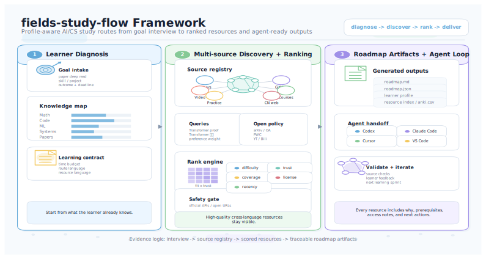

# fields-study-flow

[简体中文](README.zh-CN.md) | English

Agent-native mastery-path generator for AI/CS papers, fields, and courses.

fields-study-flow turns goals such as "master this paper", "learn diffusion models", or "reproduce YOLO" into a traceable learning path. It combines learner profile, route depth, language preferences, live open-source discovery, and explicit local resources, then exports Markdown, JSON, SVG, and a polished static HTML report.

<p align="center">
  
</p>

## What It Optimizes

- Unified dual mode: single-paper mastery and field/course learning share the same planner.
- Mastery standard: explain, derive, reproduce, and critique.
- Route depth: `fastest`, `balanced` default, or `complete`.
- Learning style: practical default, theory, video, or auto.
- Language choice: Markdown, HTML, and SVG reports follow `zh-CN`, `en`, or `bilingual` output language.
- Short routes: `fastest` and practical `balanced` routes compress broad prerequisite courses into a focused prerequisite sprint when that keeps the mastery path shorter.
- Local resources: only explicit user paths are analyzed; private paths are redacted from shareable outputs.
- Paper parsing: local PDFs expose sections, method/experiment/limitation hints, keywords, formula candidates, and code links when detectable.
- Live discovery: open official APIs are searched by default; credentialed/link-only sources remain manual-link candidates.
- Route audit: every plan explains coverage, omitted resources, time saved, and why the chosen route is the shortest visible path under the selected depth.
- Actionability: reports include study tasks, next actions, quality gates, final evidence, and runnable artifact enforcement.
- Visual output: `roadmap.svg` and `roadmap.html` show phases, key points, focus areas, time estimates, local hits, quality status, and checkpoints.

## Quick Start

```bash
python -m pip install -e .
fields-study-flow roadmap \
  --goal "learn diffusion models and build a small project" \
  --preset field-project \
  --output-language en \
  --resource-language en-first \
  --local-resource ./my-notes/diffusion
```

Use deterministic offline mode when you do not want live search:

```bash
fields-study-flow roadmap \
  --goal "master Transformer paper" \
  --no-live-search \
  --local-resource ./my-notes/transformer
```

Paper route:

```bash
fields-study-flow paper \
  --url https://arxiv.org/abs/1706.03762 \
  --preset paper-fastest \
  --output-language bilingual \
  --resource-language en-first
```

Generated files:

```text
fields-study-flow-output/
  learner_profile.json
  resource_index.json
  local_resource_analysis.json
  source_registry_snapshot.json
  roadmap.md
  roadmap.json
  roadmap.svg
  roadmap.html
  artifact_template/        # generated only when a runnable artifact is required
    README.md
    task_checklist.md
    reproduction_log.md
    notebook_skeleton.ipynb
    src/main.py
```

## Key CLI Options

| Option | Meaning |
| --- | --- |
| `--preset fastest\|balanced\|complete\|paper-fastest\|paper-deep\|field-project\|course-complete` | Start from a common planning mode; explicit options can still override it. |
| `--target-kind paper\|field\|course\|auto` | Select or infer the planning mode. |
| `--route-depth fastest\|balanced\|complete` | Control how short or comprehensive the route should be. |
| `--learning-style practical\|theory\|video\|auto` | Bias ranking toward implementation, theory, or intuition resources. |
| `--local-resource PATH` | Analyze an explicit local file/folder as a private candidate. Repeatable. |
| `--no-live-search` / `--offline` | Disable default live discovery and use deterministic local catalog behavior. |
| `--output-language zh-CN\|en\|bilingual` | Control roadmap language. |
| `--resource-language zh-first\|en-first\|balanced\|zh-only\|en-only` | Control material-language preference. |

Supported local resource types include Markdown, TXT, TeX, PDF, Jupyter notebooks, Python files, YAML/JSON/CSV, and common document/slide formats at metadata level.

## MCP-Style Tools

Run the JSON-lines tool server:

```bash
python -m fields_study_flow.mcp_server
```

Example:

```json
{"tool":"searchResources","arguments":{"query":"Transformer derivation","languagePreference":"en-first"}}
```

Available functions:

- `assessKnowledge`
- `discoverSources`
- `searchResources`
- `analyzeLocalResources`
- `ingestUrl`
- `rankResources`
- `buildRoadmap`
- `validateSources`
- `exportPlan`

`exportPlan` writes JSON, Markdown, SVG, HTML, and the `artifact_template/` package when the route needs a runnable project or reproduction checkpoint.
The template package follows the selected output language and includes paper-derived formula/code/experiment targets when available.

On Windows PowerShell, read exported JSON as UTF-8 when piping to native JSON tools:

```powershell
Get-Content .\fields-study-flow-output\roadmap.json -Raw -Encoding UTF8 | ConvertFrom-Json
```

## Architecture

```text
goal/profile
  -> unified planner options
  -> live discovery + offline catalog + explicit local resources
  -> ranking, de-duplication, quality/style weighting
  -> route-depth-aware mastery path
  -> mastery graph + route audit + quality gates + final artifact + checkpoints
  -> Markdown / JSON / SVG / HTML outputs + optional artifact template
```

Core modules:

```text
fields_study_flow/
  live_search.py      # open API discovery with credential-safe fallback
  local_resources.py  # explicit local path analysis
  paper_metadata.py   # arXiv/DOI/local-PDF metadata and fallback extraction
  artifact_templates.py # generated verification scaffold when no runnable resource fits
  ranking.py          # quality, language, time, and style scoring
  roadmap.py          # mastery graph, route selection, and renderers
  mcp_tools.py        # agent-callable functions
  cli.py              # command-line interface
```

## Safety Policy

fields-study-flow recommends and summarizes resources. It does not scan local disks by default, expose private local paths, bypass logins or paywalls, download videos, use pirate mirrors, or copy long copyrighted passages. External content is treated as untrusted source material.

## Development

```bash
python -m pip install -e .[dev]
pytest -q
```

MIT. See [LICENSE](LICENSE).
