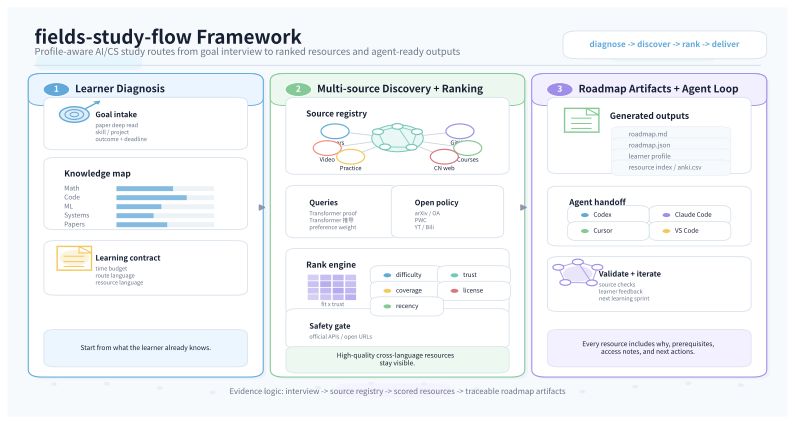

# fields-study-flow

[简体中文](README.zh-CN.md) | English

Agent-native mastery-path generator for AI/CS papers, fields, and courses.

fields-study-flow turns goals such as "master this paper", "learn diffusion models", or "reproduce YOLO" into a traceable learning path. It combines learner profile, route depth, language preferences, live open-source discovery, and explicit local resources, then exports Markdown, JSON, SVG, and a polished static HTML report.

<p align="center">
  
</p>

## What It Optimizes

- Unified dual mode: single-paper mastery and field/course learning share the same planner.
- Mastery standard: explain, derive, reproduce, and critique.
- Route depth: `fastest`, `balanced` default, or `complete`.
- Learning style: practical default, theory, video, or auto.
- Language choice: Markdown, HTML, and SVG reports follow `zh-CN`, `en`, or `bilingual` output language.
- Short routes: `fastest` and practical `balanced` routes compress broad prerequisite courses into a focused prerequisite sprint when that keeps the mastery path shorter.
- Local resources: only explicit user paths are analyzed; private paths are redacted from shareable outputs.
- Paper parsing: local PDFs expose sections, method/experiment/limitation hints, keywords, formula candidates, and code links when detectable.
- Paper Map: paper routes export `paper_map.html`, an offline graphical Xmind-flow canvas with draggable/zoomable nodes, SVG causal edges, expandable branches, and a detail panel for evidence and presentation wording.
- Paper Lens: paper routes export `paper_lens.html`, a standalone target-paper reader that maps collected literature, bundle files, evidence snippets, and tasks back onto paragraph-level target-paper explanations.
- Evidence-driven RAG: local resources and study bundles are chunked into a lightweight `.rag_index`; key points, resource reasons, and validation tasks can cite supporting snippets.
- Learning knowledge graph: reports include a local, evidence-driven concept -> resource -> task -> assessment graph for navigation and mastery tracing.
- Live discovery: open official APIs are searched by default; credentialed/link-only sources remain manual-link candidates.
- Route audit: every plan explains coverage, omitted resources, time saved, and why the chosen route is the shortest visible path under the selected depth.
- Actionability: reports include study tasks, next actions, quality gates, final evidence, and runnable artifact enforcement.
- Folder entry: `index.html` is the first file to open after export. It routes learners to Paper Map, Paper Lens, or the roadmap checklist depending on what the plan contains.
- Market value panel: `index.html` explains the product wedge before learners open the detailed reports: Paper Map logic, evidence-backed reading, local resource bundles, and mastery proof.
- Recommended first action: the start page now highlights the best first click for the current report, with alternate paths for presentation, mastery validation, or bringing your own paper.
- Intent router: the start page lets learners choose the right first click by goal: fastest understanding, presentation preparation, or mastery validation/reproduction.
- Interactive learning console: `roadmap.html` contains the roadmap, draggable/zoomable KG network, right-side task guide with local progress checks, local-first resource links, multi-dimensional resource filter chips, evidence expand/collapse, and collapsible phases.
- Resource purpose, strength, provenance, and coverage badges: roadmap resources explain whether they are primary evidence, background, implementation/reproduction help, or validation material, where they came from, which paper-logic or learning surface they cover, plus a short "why read" hint and core/support/fallback strength signal.
- Portable mastery worksheet: the roadmap checklist can be copied or downloaded as `mastery_worksheet.md`, turning explain/derive/reproduce/critique tasks into a shareable evidence log.
- Study bundle start page: the local resource folder includes a Chinese-first `README.md` dashboard with a 10-minute start path, local file groups, link-only resources, and retry guidance.

## Quick Start

Try the product with zero setup first:

```bash
python -m pip install -e .
fields-study-flow demo --output-dir ./fields-study-flow-demo
```

Then open `fields-study-flow-demo/index.html`. The demo uses a bundled Transformer-paper route and local `study-assets/` bundle, so you can evaluate the Paper Map, Paper Lens, local report structure, local-first resources, and mastery checklist before bringing your own PDF.
The start page also shows the exact next commands for replacing the demo with a public paper URL or a local PDF.
To generate the demo and a compact market-readiness summary in one step:

```bash
fields-study-flow demo --output-dir ./fields-study-flow-demo --market-check
```

This writes `demo_market_check.json`, `release_readiness.md`, and `release_readiness.html`, and adds a release-decision entry to `index.html`. Add `--market-fresh-user-minutes`, `--market-check-screenshots`, and `--market-check-interactions` when you have measured timing and the optional browser runtime available.

Audit the exported HTML for common visual and privacy risks:

```bash
fields-study-flow audit-report --report-dir ./fields-study-flow-demo
```

When Python Playwright and a browser binary are available, add real desktop/mobile screenshot capture:

```bash
python -m pip install -e ".[visual]"
python -m playwright install chromium
fields-study-flow audit-report --report-dir ./fields-study-flow-demo --capture-screenshots
fields-study-flow audit-report --report-dir ./fields-study-flow-demo --probe-interactions
```

Screenshots and a relative-path manifest are written under `visual-snapshots/`. The interaction probe opens the offline report in a browser and smoke-tests the Paper Map branch toggle, node detail panel, zoom/pan surface, Paper Lens paragraph selection, and roadmap resource filters. If the optional browser runtime is not installed, these commands report clear skipped browser checks while keeping the lightweight static audit usable.
Once a report looks good and screenshot capture has produced real `pass` captures, save that manifest as a golden baseline and compare future exports against it:

```bash
copy fields-study-flow-demo\visual-snapshots\manifest.json docs\visual-baselines\demo.manifest.json
fields-study-flow audit-report --report-dir ./fields-study-flow-demo --snapshot-baseline docs/visual-baselines/demo.manifest.json
```

The baseline check compares required pages, desktop/mobile viewports, dimensions, and screenshot hashes. A missing page or changed screenshot exits nonzero, making it suitable for release checks.

To verify onboarding speed, time a first-time learner from opening `index.html` to reaching the first mastery task, then record the measured minutes:

```bash
fields-study-flow audit-report --report-dir ./fields-study-flow-demo --write-fresh-user-worksheet
fields-study-flow audit-report --report-dir ./fields-study-flow-demo --fresh-user-minutes 8.5
```

The worksheet asks the reviewer to record each checkpoint, blocker, and fix idea. The default target is 10 minutes. Use `--fresh-user-target-minutes N` if your release gate uses a different threshold; the command exits nonzero when the run exceeds the target.

After several first-run tests, aggregate the completed worksheets into a ranked product backlog:

```bash
fields-study-flow audit-report \
  --report-dir ./fields-study-flow-demo \
  --fresh-user-worksheet-input ./fields-study-flow-demo/fresh_user_test.md \
  --write-fresh-user-backlog
```

The generated `fresh_user_backlog.md` ranks repeated blockers first and keeps only relative report artifacts, so it can be shared without leaking private local paths.

Across releases or repeated report variants, aggregate backlog files into a trend report:

```bash
fields-study-flow audit-report \
  --report-dir ./fields-study-flow-demo \
  --fresh-user-backlog-input ./fields-study-flow-demo/fresh_user_backlog.md \
  --write-fresh-user-trend-report
```

The generated `fresh_user_trends.md` highlights blockers that recur across multiple reports, helping turn usability testing into a release-by-release product improvement loop.

Write a human-readable release decision dashboard after the machine checks:

```bash
fields-study-flow audit-report \
  --report-dir ./fields-study-flow-demo \
  --capture-screenshots \
  --probe-interactions \
  --fresh-user-backlog-input ./fields-study-flow-demo/fresh_user_backlog.md \
  --write-fresh-user-trend-report \
  --write-release-readiness \
  --write-release-history
```

The generated `release_readiness.md` and `release_readiness.html` combine `report_audit.json`, visual checks, screenshot/baseline status, browser interaction probes, fresh-user timing, recurring blockers, a market experience scorecard, and a market positioning matrix into a single `ship` / `needs_work` / `do_not_ship` decision. The HTML version is a single offline page for non-technical reviewers, and `index.html` automatically receives a single release-decision entry that links to it. A report is not marked `ship` unless measured fresh-user timing, real visual evidence, and browser interaction evidence pass. Its gates are explicitly inspired by Elicit/SciSpace evidence transparency, NotebookLM-style portable study outputs, ResearchRabbit/roadmap.sh visual navigation, React Flow canvas affordances, local-first resource bundles, and mastery proof. The scorecard rates UI/interface polish, content depth, plain-language clarity, first-run ease, evidence trust, resource completeness, and portable outputs; the positioning matrix compares the report against Elicit, PaperQA2, Explainpaper, roadmap.sh, React Flow/xyflow, Get It, and literature-map products, then turns each competitor lesson into current evidence, next proof, and a prioritized market opportunity backlog.
With `--write-release-history`, the audit also writes `release_readiness_history.jsonl`, `release_readiness_history.md`, and `release_readiness_history.html`, a sanitized cross-run decision log with a trend summary, score delta, and recurring-blocker delta for comparing whether report quality is actually improving across releases or CI runs. The report start page and release-readiness dashboard both receive a single quality-trend entry that links to the HTML dashboard.

To avoid overfitting release confidence to one polished demo, pass multiple exported reports into a market sample matrix:

```bash
fields-study-flow audit-report \
  --report-dir ./fields-study-flow-demo \
  --market-sample-dir ./samples/single-paper \
  --market-sample-dir ./samples/paper-set \
  --market-sample-dir ./samples/field-course \
  --write-release-readiness
```

The matrix checks whether the evidence covers the three product scenarios: single paper, paper set, and field/course route. Missing scenarios appear in `release_readiness.md` / `release_readiness.html` as `needs_work` next actions, so the project does not claim broad market readiness from a single cherry-picked report.

For a zero-setup cross-scenario sample suite, generate all three offline demos in one command:

```bash
fields-study-flow demo \
  --sample all-market \
  --output-dir ./fields-study-flow-market-samples \
  --market-check \
  --market-fresh-user-minutes 8.5
```

This writes one root `index.html`, three sample reports (`transformer-paper`, `diffusion-paper-set`, and `diffusion-field-course`), per-sample `report_audit.json`, and a root `market_sample_matrix.json` that must cover all three scenarios before the suite is treated as market-ready evidence.

The audit also emits `report_audit.json` with market-readiness, fresh-user-flow, experience, viewport, visual-snapshot-matrix, and competitor-benchmark checks so a report cannot be treated as product-ready while it lacks grounded evidence, portable study outputs, a measurable Paper Map, an intent-based first click, a clear first-10-minutes path, canvas affordances, dense-resource layout safety, or a local-first study bundle. When the command generates release dashboards, it adds `generated_artifact_audit` to the JSON output so the newly written HTML pages are checked in the same run.

```bash
fields-study-flow roadmap \
  --goal "learn diffusion models and build a small project" \
  --preset field-project \
  --output-language en \
  --resource-language en-first \
  --local-resource ./my-notes/diffusion \
  --resource-dir ./study-assets/diffusion \
  --bundle-scope all
```

Use deterministic offline mode when you do not want live search:

```bash
fields-study-flow roadmap \
  --goal "master Transformer paper" \
  --no-live-search \
  --local-resource ./my-notes/transformer
```

Paper route:

```bash
fields-study-flow paper \
  --url https://arxiv.org/abs/1706.03762 \
  --preset paper-fastest \
  --output-language bilingual \
  --resource-language en-first \
  --resource-dir ./study-assets/transformer
```

Guided mode asks for language, storage, learning preferences, and `bundle_scope` when a study bundle is enabled:

```bash
fields-study-flow paper --interactive
fields-study-flow roadmap --interactive
```

After generation, open `index.html` first. It chooses the clearest entry for the current goal, usually Paper Map for a single paper, then Paper Lens, then the roadmap checklist.

Generated files:

```text
fields-study-flow-output/
  index.html              # start here: links to the best report for the current goal
  learner_profile.json
  resource_index.json
  local_resource_analysis.json
  source_registry_snapshot.json
  roadmap.md
  roadmap.json
  roadmap.svg
  roadmap.html            # interactive roadmap and mastery checklist
  paper_map.html          # Offline Xmind-flow paper map canvas, generated when a target paper is present
  paper_lens.html         # target-paper reader, generated when a target paper is present
  artifact_template/        # generated only when a runnable artifact is required
    README.md
    task_checklist.md
    reproduction_log.md
    notebook_skeleton.ipynb
    src/main.py

study-assets/
  study_bundle_manifest.json # generated when --resource-dir is set
  README.md                   # bundle summary and how to start
  .rag_index/manifest.json   # generated for evidence retrieval and bundle Q&A
  links.md
  01-selected-local-or-open-resource.pdf
```

When `--resource-dir` is used, downloaded/copied resources in `roadmap.html`, `paper_map.html`, `paper_lens.html`, and `roadmap.md` link to the local study bundle first. Original web links remain visible only as fallback/source links, and absolute local paths are still redacted from shareable outputs.
The resource folder's `README.md` is meant to be opened directly: it shows bundle completion, the recommended first 10 minutes, route resources, supplemental resources, and how to retry failed downloads. In `roadmap.html`, the mastery checklist can also be copied or downloaded as `mastery_worksheet.md` for notes, reports, or review.

Ask a question against the downloaded/copied bundle only:

```bash
fields-study-flow ask \
  --roadmap fields-study-flow-output/roadmap.json \
  --resource-dir ./study-assets/diffusion \
  --question "Which evidence explains the reproduction target?"
```

## Key CLI Options

| Option | Meaning |
| --- | --- |
| `--preset fastest\|balanced\|complete\|paper-fastest\|paper-deep\|field-project\|course-complete` | Start from a common planning mode; explicit options can still override it. |
| `--target-kind paper\|field\|course\|auto` | Select or infer the planning mode. |
| `--route-depth fastest\|balanced\|complete` | Control how short or comprehensive the route should be. |
| `--learning-style practical\|theory\|video\|auto` | Bias ranking toward implementation, theory, or intuition resources. |
| `--local-resource PATH` | Analyze an explicit local file/folder as a private candidate. Repeatable. |
| `--resource-dir PATH` | Copy/download the study resource library into a private study folder and write `study_bundle_manifest.json`. |
| `--bundle-scope selected\|all` | Choose whether the bundle downloads only selected route resources or all directly obtainable candidates. Default: `all`; unavailable resources remain in `links.md`. |
| `--rag off\|light\|auto\|embedding` | Control evidence retrieval. `auto` uses lightweight local retrieval; `embedding` uses the optional `rag` extra when installed. |
| `--no-paper-map` | Skip the standalone `paper_map.html` logic map even when a target paper is present. |
| `--paper-map-language auto\|zh-CN\|en\|bilingual` | Control generated Paper Map explanation language. `auto` follows the prompt/output language. |
| `--paper-map-depth quick\|standard\|complete` | Control how many supporting branches are attached to the paper logic map. Default: `standard`. |
| `--paper-map-layout xmind-flow` | Use the graphical Xmind + causal-flow canvas layout. This is the default. |
| `--paper-map-provider local\|auto\|llm` | Choose the Paper Map extraction policy. `auto` uses local rules unless an extension provider is configured. |
| `--no-paper-lens` | Skip the standalone `paper_lens.html` reader even when a target paper is present. |
| `--paper-lens-language auto\|zh-CN\|en\|bilingual` | Control generated Paper Lens explanation language. `auto` follows the prompt/output language. |
| `--paper-lens-density key\|section\|dense` | Control how many target-paper segments receive inline explanations. Default: `dense`. |
| `--paper-lens-granularity paragraph\|sentence` | Control whether Paper Lens explains paragraph blocks or legacy sentence units. Default: `paragraph`. |
| `--interactive` | Ask for goal, language, route depth, learning style, local resources, output directory, and resource directory before executing. |
| `--no-live-search` / `--offline` | Disable default live discovery and use deterministic local catalog behavior. |
| `--output-language zh-CN\|en\|bilingual` | Control roadmap language. |
| `--resource-language zh-first\|en-first\|balanced\|zh-only\|en-only` | Control material-language preference. |

Supported local resource types include Markdown, TXT, TeX, PDF, Jupyter notebooks, Python files, YAML/JSON/CSV, and common document/slide formats at metadata level. Resource bundling copies only paths the user explicitly provided. With the default `--bundle-scope all`, it attempts every directly obtainable candidate: arXiv PDFs, raw GitHub files, public GitHub archives, and ordinary public-page snapshots when the server allows it. With `--bundle-scope selected`, it keeps the faster shortest-route bundle behavior. Videos, restricted pages, failed downloads, and credentialed sources stay as links in `links.md`, and the manifest records selected/omitted plus downloaded/link-only status.

Embedding retrieval is optional:

```bash
python -m pip install -e .[rag]
```

## MCP-Style Tools

Run the JSON-lines tool server:

```bash
python -m fields_study_flow.mcp_server
```

Example:

```json
{"tool":"searchResources","arguments":{"query":"Transformer derivation","languagePreference":"en-first"}}
```

Available functions:

- `assessKnowledge`
- `discoverSources`
- `searchResources`
- `analyzeLocalResources`
- `ingestUrl`
- `rankResources`
- `buildRoadmap`
- `retrieveEvidence`
- `answerFromBundle`
- `validateSources`
- `exportPlan`

`exportPlan` writes JSON, Markdown, SVG, HTML, `paper_lens.html` when a target paper is present, and the `artifact_template/` package when the route needs a runnable project or reproduction checkpoint.
The template package follows the selected output language and includes paper-derived formula/code/experiment targets when available.

The exporter prefers the React/Vite static frontend when `fields_study_flow/frontend_dist/manifest.json` is available, and falls back to the built-in Python HTML renderer when frontend assets are missing. The React frontend is still offline-first: no CDN, no remote fonts, and JSON data is embedded in the exported report shell.

To rebuild frontend assets:

```bash
cd frontend
npm install
npm run test
npm run build
```

The build writes static assets into `fields_study_flow/frontend_dist/`, which is included in Python package data. Task progress is stored in the browser via `localStorage` when available; if the browser blocks local storage, the report still works as a readable, clickable study console and simply treats checkmarks as temporary.

On Windows PowerShell, read exported JSON as UTF-8 when piping to native JSON tools:

```powershell
Get-Content .\fields-study-flow-output\roadmap.json -Raw -Encoding UTF8 | ConvertFrom-Json
```

## Architecture

```text
goal/profile
  -> unified planner options
  -> live discovery + offline catalog + explicit local resources
  -> lightweight RAG chunks + evidence retrieval
  -> lightweight learning knowledge graph
  -> ranking, de-duplication, quality/style weighting
  -> route-depth-aware mastery path
  -> mastery graph + route audit + quality gates + final artifact + checkpoints
  -> Markdown / JSON / SVG / HTML outputs + optional artifact template
```

Core modules:

```text
fields_study_flow/
  live_search.py      # open API discovery with credential-safe fallback
  local_resources.py  # explicit local path analysis
  paper_metadata.py   # arXiv/DOI/local-PDF metadata and fallback extraction
  paper_map.py        # Xmind-flow single-paper graph model and offline HTML renderer
  paper_lens.py       # target-paper reading layer with section evidence and local-first links
  frontend_report.py  # React/Vite report shell integration and asset copying
  artifact_templates.py # generated verification scaffold when no runnable resource fits
  rag.py              # local evidence chunks, bundle index, retrieval, and bundle Q&A
  knowledge_graph.py  # local concept/resource/task/assessment learning graph
  ranking.py          # quality, language, time, and style scoring
  roadmap.py          # mastery graph, route selection, and renderers
  mcp_tools.py        # agent-callable functions
  cli.py              # command-line interface
```

## Safety Policy

fields-study-flow recommends and summarizes resources. It does not scan local disks by default, expose private local paths in shareable reports, bypass logins or paywalls, download videos, use pirate mirrors, or copy long copyrighted passages. When `--resource-dir` is used, downloaded/copied files are kept in the private local bundle selected by the user. External content is treated as untrusted source material.

## Development

```bash
python -m pip install -e .[dev]
pytest -q
```

MIT. See [LICENSE](LICENSE).
