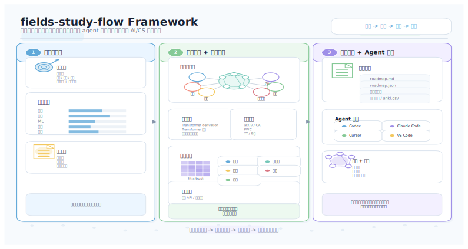

# fields-study-flow

简体中文 | [English](README.md)

面向 AI/CS 论文、领域和课程学习的 agent-native 掌握路径生成器。

fields-study-flow 可以把“掌握这篇论文”“学习 diffusion models”“复现 YOLO”这类目标，转成一条可追踪、可验证的学习路径。它会综合学习者画像、路线深度、语言偏好、开放来源实时搜索和显式提供的本地资源，最后导出 Markdown、JSON、SVG 和美观的静态 HTML 报告。

<p align="center">
  
</p>

## 它优化什么

- 统一双模式：单篇论文掌握和领域/课程学习共用同一个 planner。
- 掌握标准：讲清楚、推导关键点、复现核心方法、批判局限。
- 路线深度：`fastest`、默认 `balanced`、或 `complete`。
- 学习风格：默认实战复现优先，也支持理论优先、视频优先和自动模式。
- 语言选择：Markdown、HTML、SVG 报告会遵循 `zh-CN`、`en` 或 `bilingual` 输出语言。
- 最短路线：`fastest` 和实战型 `balanced` 会把宽泛前置课程压缩成紧贴目标的前置冲刺。
- 本地资源：只分析用户显式传入的路径，共享输出中不暴露本地绝对路径。
- 论文解析：本地 PDF 会尽量抽取章节、方法/实验/局限提示、关键词、公式候选和代码链接。
- 实时搜索：默认搜索开放官方 API；需要凭证或只适合手动链接的平台不会被自动抓取。
- 路线审计：每条路线都会说明覆盖度、省略资源、节省耗时，以及为什么这是当前候选和路线深度下的最短可行路径。
- 可执行任务：报告包含学习任务、下一步行动、质量门、最终证据和可运行产物验收。
- 可视化输出：`roadmap.svg` 和 `roadmap.html` 展示阶段、重点、关键点、耗时、本地资源命中、质量状态和验收任务。

## 快速开始

```bash
python -m pip install -e .
fields-study-flow roadmap \
  --goal "学习 diffusion models 并做一个小项目" \
  --preset field-project \
  --output-language zh-CN \
  --resource-language en-first \
  --local-resource ./my-notes/diffusion
```

如果不希望实时搜索，可以使用确定性的离线模式：

```bash
fields-study-flow roadmap \
  --goal "掌握 Transformer 论文" \
  --no-live-search \
  --local-resource ./my-notes/transformer
```

论文深读路线：

```bash
fields-study-flow paper \
  --url https://arxiv.org/abs/1706.03762 \
  --preset paper-fastest \
  --output-language bilingual \
  --resource-language en-first
```

生成文件：

```text
fields-study-flow-output/
  learner_profile.json
  resource_index.json
  local_resource_analysis.json
  source_registry_snapshot.json
  roadmap.md
  roadmap.json
  roadmap.svg
  roadmap.html
  artifact_template/        # 仅在需要可运行项目或复现验收时生成
    README.md
    task_checklist.md
    reproduction_log.md
    notebook_skeleton.ipynb
    src/main.py
```

## 关键参数

| 参数 | 含义 |
| --- | --- |
| `--preset fastest\|balanced\|complete\|paper-fastest\|paper-deep\|field-project\|course-complete` | 使用常见学习模式快速启动；显式参数仍可覆盖 preset。 |
| `--target-kind paper\|field\|course\|auto` | 指定或自动判断论文、领域、课程模式。 |
| `--route-depth fastest\|balanced\|complete` | 控制路线是最短、平衡还是最完整。 |
| `--learning-style practical\|theory\|video\|auto` | 控制资源排序偏向实战、理论或直觉材料。 |
| `--local-resource PATH` | 分析显式提供的本地文件或文件夹，可重复传入。 |
| `--no-live-search` / `--offline` | 关闭默认实时搜索，使用确定性目录和显式资源。 |
| `--output-language zh-CN\|en\|bilingual` | 控制路线输出语言。 |
| `--resource-language zh-first\|en-first\|balanced\|zh-only\|en-only` | 控制资料语言偏好。 |

本地资源支持 Markdown、TXT、TeX、PDF、Jupyter Notebook、Python、YAML/JSON/CSV，以及常见文档和课件格式的元数据级分析。

## MCP 风格工具

运行 JSON-lines 工具服务：

```bash
python -m fields_study_flow.mcp_server
```

示例：

```json
{"tool":"searchResources","arguments":{"query":"Transformer derivation","languagePreference":"en-first"}}
```

可用函数：

- `assessKnowledge`
- `discoverSources`
- `searchResources`
- `analyzeLocalResources`
- `ingestUrl`
- `rankResources`
- `buildRoadmap`
- `validateSources`
- `exportPlan`

`exportPlan` 会写出 JSON、Markdown、SVG、HTML；当路线需要可运行项目或复现验收时，还会写出 `artifact_template/` 模板包。
模板包会遵循所选输出语言；如果有论文解析结果，也会写入公式、代码链接、实验和局限相关验收目标。

在 Windows PowerShell 中读取导出的 JSON 时，建议显式使用 UTF-8：

```powershell
Get-Content .\fields-study-flow-output\roadmap.json -Raw -Encoding UTF8 | ConvertFrom-Json
```

## 架构

```text
目标/画像
  -> 统一规划参数
  -> 实时搜索 + 离线目录 + 显式本地资源
  -> 排序、去重、质量/风格加权
  -> 按路线深度选择掌握路径
  -> 掌握图谱 + 路线审计 + 质量门 + 最终产出 + 检查点
  -> Markdown / JSON / SVG / HTML 输出 + 可选验收模板包
```

核心模块：

```text
fields_study_flow/
  live_search.py      # 开放 API 搜索与凭证安全降级
  local_resources.py  # 显式本地路径分析
  paper_metadata.py   # arXiv/DOI/本地 PDF 元数据与降级解析
  artifact_templates.py # 缺少可运行资源时生成验收模板
  ranking.py          # 质量、语言、耗时、学习风格评分
  roadmap.py          # 掌握图谱、路线选择和渲染器
  mcp_tools.py        # agent 可调用函数
  cli.py              # 命令行入口
```

## 安全边界

fields-study-flow 只推荐、摘要和链接资源。它不会默认扫描本地磁盘，不会在共享输出中暴露私有路径，不会绕过登录或付费墙，不会下载视频，不会使用盗版镜像，也不会复制长篇版权内容。所有外部内容都应被视为不可信来源材料。

## 开发

```bash
python -m pip install -e .[dev]
pytest -q
```

MIT。见 [LICENSE](LICENSE)。
