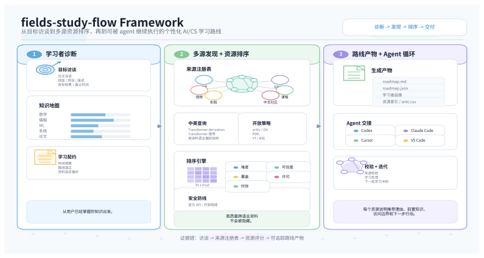

# fields-study-flow

## 最新功能快速说明

- 单篇论文路线现在会额外生成 `paper_map.html`，这是一个离线可打开的 Xmind-flow 图形画布：支持节点拖拽、缩放、SVG 因果连线、分支展开/收起，以及右侧证据和汇报话术详情。
- 单篇论文路线也会生成 `paper_lens.html`，这是一个独立的“目标论文增强阅读器”。
- `paper_lens.html` 会按摘要、背景、方法、公式、实验、局限和相关工作组织阅读卡片，并把资料包中的论文、书籍、代码、网页快照和 RAG 证据片段挂回对应章节。
- 新版 Paper Lens 默认生成“原文段落精读流”：悬浮或点击核心段落即可查看直白解释、方法说明、相关资料和证据；如需旧体验可使用 `--paper-lens-granularity sentence`。
- 使用 `--resource-dir` 时，`roadmap.html`、`paper_map.html`、`paper_lens.html` 和 `roadmap.md` 会优先链接到本地已下载/复制资料；未下载或仅链接资料才保留原始网络入口。
- 如果只想保留路线报告，可以在 `paper` 或 `roadmap` 命令中加入 `--no-paper-lens`。
- 共享型 JSON/HTML/MD 仍会隐藏 `C:\private-path`、`D:\private-path` 等本地绝对路径，只保留相对本地链接或脱敏标识。

简体中文 | [English](README.md)

面向 AI/CS 论文、领域和课程学习的 agent-native 掌握路径生成器。

fields-study-flow 可以把“掌握这篇论文”“学习 diffusion models”“复现 YOLO”这类目标，转成一条可追踪、可验证的学习路径。它会综合学习者画像、路线深度、语言偏好、开放来源实时搜索和显式提供的本地资源，最后导出 Markdown、JSON、SVG 和美观的静态 HTML 报告。

<p align="center">
  
</p>

## 它优化什么

- 统一双模式：单篇论文掌握和领域/课程学习共用同一个 planner。
- 掌握标准：讲清楚、推导关键点、复现核心方法、批判局限。
- 路线深度：`fastest`、默认 `balanced`、或 `complete`。
- 学习风格：默认实战复现优先，也支持理论优先、视频优先和自动模式。
- 语言选择：Markdown、HTML、SVG 报告会遵循 `zh-CN`、`en` 或 `bilingual` 输出语言。
- 最短路线：`fastest` 和实战型 `balanced` 会把宽泛前置课程压缩成紧贴目标的前置冲刺。
- 本地资源：只分析用户显式传入的路径，共享输出中不暴露本地绝对路径。
- 论文解析：本地 PDF 会尽量抽取章节、方法/实验/局限提示、关键词、公式候选和代码链接。
- RAG 证据路线：目标论文、本地资源和资料包会被切分成轻量证据片段，写入 `.rag_index`，关键点、推荐理由和验收任务都可以引用来源片段。
- 学习知识图谱：报告会展示本地轻量的 concept -> resource -> task -> assessment 图谱，用于导航和掌握追踪。
- 实时搜索：默认搜索开放官方 API；需要凭证或只适合手动链接的平台不会被自动抓取。
- 路线审计：每条路线都会说明覆盖度、省略资源、节省耗时，以及为什么这是当前候选和路线深度下的最短可行路径。
- 可执行任务：报告包含学习任务、下一步行动、质量门、最终证据和可运行产物验收。
- 文件夹入口：导出后优先打开 `index.html`，它会根据当前计划引导用户进入 Paper Map、Paper Lens 或路线验收清单。
- 学习意图路由：`index.html` 会按“最快理解、准备汇报、验收/复现”给出入口，用户不需要先理解所有报告类型。
- 第一轮学习会话：`index.html` 会给出约 45-60 分钟的时间盒学习闭环，把 Paper Map、Paper Lens、主动回忆和第一项掌握验收任务串起来，用户不用自己先规划学习节奏。
- 交互式学习中控台：`roadmap.html` 提供学习路线、可拖动/缩放的 KG 学习路径网络、右侧任务向导、本地进度勾选、本地优先资料链接、多维资料筛选 chips、证据展开/收起和阶段折叠。
- 资源来源与覆盖范围：`roadmap.html` 的资料卡会显示资料用途、证据强度、来源类型，以及它覆盖论文逻辑或学习任务的哪一部分，方便用户先打开最有用的资料。
- 可带走的掌握证据：路线里的掌握验收清单可以复制或下载为 `mastery_worksheet.md`，把解释、推导、复现和批判任务变成可提交、可复查的学习证据表。
- 资料包开始页：本地资料目录会生成中文优先的 `README.md` 仪表盘，包含 10 分钟开始路径、路线资料、补充资料、仅链接资源和失败重试说明。

## 快速开始

先用零准备 demo 试跑一遍：

```bash
python -m pip install -e .
fields-study-flow demo --output-dir ./fields-study-flow-demo
```

然后打开 `fields-study-flow-demo/index.html`。这个 demo 使用内置 Transformer 论文样例，并自带本地 `study-assets/` 资料包；用户不需要先准备 PDF，就能评估 Paper Map、Paper Lens、本地报告结构、本地优先资料和掌握验收清单是否有用。
入口页里也会直接给出“换成自己的论文”的 URL 和本地 PDF 命令模板。
如果想一条命令同时生成 demo 和市场化审计摘要：

```bash
fields-study-flow demo --output-dir ./fields-study-flow-demo --market-check
```

它会写出 `demo_market_check.json`、`release_readiness.md` 和 `release_readiness.html`，并在 `index.html` 加入发布决策入口。当你已经有真实新用户耗时，并且本机安装了可选浏览器运行时时，可以再加 `--market-fresh-user-minutes`、`--market-check-screenshots` 和 `--market-check-interactions`。

检查导出的 HTML 是否存在常见排版和隐私风险：

```bash
fields-study-flow audit-report --report-dir ./fields-study-flow-demo
```

如果本机安装了 Python Playwright 和浏览器运行时，也可以打开真实桌面/移动端截图捕获：

```bash
python -m pip install -e ".[visual]"
python -m playwright install chromium
fields-study-flow audit-report --report-dir ./fields-study-flow-demo --capture-screenshots
fields-study-flow audit-report --report-dir ./fields-study-flow-demo --probe-interactions
```

截图和相对路径 manifest 会写入 `visual-snapshots/`；交互探针会在浏览器里打开离线报告，冒烟测试 Paper Map 分支展开、节点详情、缩放/平移、Paper Lens 段落选择和 roadmap 资料筛选。如果没有安装可选浏览器运行时，命令会明确显示截图或交互检查被跳过，不影响基础静态审查。

当你确认某次导出的页面足够好看，并且截图捕获已经产生真实 `pass` 截图后，可以把 manifest 保存成黄金基线，后续导出用它做 UI 回归比较：

```bash
copy fields-study-flow-demo\visual-snapshots\manifest.json docs\visual-baselines\demo.manifest.json
fields-study-flow audit-report --report-dir ./fields-study-flow-demo --snapshot-baseline docs/visual-baselines/demo.manifest.json
```

基线检查会比较页面、桌面/移动端视口、尺寸和截图哈希；如果漏掉页面或截图变化，命令会返回失败，适合放进发布前检查。

想验证上手速度时，可以让一位第一次使用的学习者从打开 `index.html` 开始计时，到进入第一项掌握验收任务为止，然后记录耗时：

```bash
fields-study-flow audit-report --report-dir ./fields-study-flow-demo --write-fresh-user-worksheet
fields-study-flow audit-report --report-dir ./fields-study-flow-demo --fresh-user-minutes 8.5
```

worksheet 会让评审者记录每一步、卡点和修复想法。默认目标是 10 分钟；如果你的发布门槛不同，可以用 `--fresh-user-target-minutes N` 调整。超过目标时间时命令会返回失败。

做完多轮新用户测试后，可以把填好的 worksheet 聚合成按频次排序的产品改进 backlog：

```bash
fields-study-flow audit-report \
  --report-dir ./fields-study-flow-demo \
  --fresh-user-worksheet-input ./fields-study-flow-demo/fresh_user_test.md \
  --write-fresh-user-backlog
```

生成的 `fresh_user_backlog.md` 会把重复出现的卡点排在前面，并继续避免泄露本地绝对路径。

跨多个版本或多份报告时，还可以把多个 backlog 聚合成趋势报告：

```bash
fields-study-flow audit-report \
  --report-dir ./fields-study-flow-demo \
  --fresh-user-backlog-input ./fields-study-flow-demo/fresh_user_backlog.md \
  --write-fresh-user-trend-report
```

生成的 `fresh_user_trends.md` 会突出跨报告反复出现的卡点，方便把可用性测试变成持续产品改进闭环。

发布前可以再生成一个给人看的发布决策面板：

```bash
fields-study-flow audit-report \
  --report-dir ./fields-study-flow-demo \
  --capture-screenshots \
  --probe-interactions \
  --fresh-user-backlog-input ./fields-study-flow-demo/fresh_user_backlog.md \
  --write-fresh-user-trend-report \
  --write-release-readiness \
  --write-release-history
```

生成的 `release_readiness.md` 和 `release_readiness.html` 会把 `report_audit.json`、视觉检查、截图/基线状态、浏览器交互探针、新用户耗时和反复出现的卡点合成一个 `ship` / `needs_work` / `do_not_ship` 决策。HTML 版本是单文件离线页面，更适合非技术评审直接打开；`index.html` 也会自动出现一个不重复的发布决策入口，直接链接到这个面板。没有通过新用户计时、真实视觉证据和浏览器交互证据的报告不会被标记为 `ship`。它的门槛明确对齐 Elicit/SciSpace 的证据透明、NotebookLM 式可带走学习产物、ResearchRabbit/roadmap.sh 的可视化导航、React Flow 的画布交互、本地优先资料包，以及可验收掌握证据。
加上 `--write-release-history` 后，还会生成 `release_readiness_history.jsonl`、`release_readiness_history.md` 和 `release_readiness_history.html`，用脱敏的跨版本发布决策记录、趋势摘要、分数变化和反复卡点变化来判断报告质量是否真的在持续变好。报告首页和发布准备度面板都会自动出现一个不重复的质量趋势入口，直接链接到 HTML 面板。
当命令写出这些发布面板时，JSON 输出还会包含 `generated_artifact_audit`，同一次运行就会重新检查刚生成的 HTML 页面，避免新面板没有被视觉和隐私规则覆盖。审计还会检查首页是否有基于学习意图的入口选择，避免用户一打开报告就不知道该先点哪里。

```bash
fields-study-flow roadmap \
  --goal "学习 diffusion models 并做一个小项目" \
  --preset field-project \
  --output-language zh-CN \
  --resource-language en-first \
  --local-resource ./my-notes/diffusion \
  --resource-dir ./study-assets/diffusion \
  --bundle-scope all
```

如果不希望实时搜索，可以使用确定性的离线模式：

```bash
fields-study-flow roadmap \
  --goal "掌握 Transformer 论文" \
  --no-live-search \
  --local-resource ./my-notes/transformer
```

论文深读路线：

```bash
fields-study-flow paper \
  --url https://arxiv.org/abs/1706.03762 \
  --preset paper-fastest \
  --output-language bilingual \
  --resource-language en-first \
  --resource-dir ./study-assets/transformer
```

交互向导会先询问语言、存储、学习偏好；如果启用资料包，也会继续询问 `bundle_scope`，再执行规划：

```bash
fields-study-flow paper --interactive
fields-study-flow roadmap --interactive
```

生成完成后优先打开 `index.html`。它会按当前目标给出最清晰的入口：单篇论文通常先进入 Paper Map，再进入 Paper Lens，最后按路线清单验收。

生成文件：

```text
fields-study-flow-output/
  index.html              # 从这里开始：按当前目标推荐最合适的报告入口
  learner_profile.json
  resource_index.json
  local_resource_analysis.json
  source_registry_snapshot.json
  roadmap.md
  roadmap.json
  roadmap.svg
  roadmap.html            # 交互式学习路线和掌握验收清单
  paper_map.html          # 离线 Xmind-flow 目标论文图形画布
  paper_lens.html         # 目标论文增强阅读器
  artifact_template/        # 仅在需要可运行项目或复现验收时生成
    README.md
    task_checklist.md
    reproduction_log.md
    notebook_skeleton.ipynb
    src/main.py

study-assets/
  study_bundle_manifest.json # 设置 --resource-dir 时生成
  README.md                   # 资料包摘要和开始学习说明
  .rag_index/manifest.json   # 用于证据检索和资料包问答
  links.md
  01-selected-local-or-open-resource.pdf
```

使用 `--resource-dir` 时，`roadmap.html`、`paper_map.html`、`paper_lens.html` 和 `roadmap.md` 中已下载/复制的资料会优先链接到本地资料包。原始网页链接仍作为来源或兜底入口展示，共享型输出仍不会暴露本地绝对路径。
资料包里的 `README.md` 可以直接打开：它会显示完成率、推荐前 10 分钟怎么学、路线资料和补充资料分组，以及失败下载如何重试。`roadmap.html` 中的掌握验收清单也可以复制或下载为 `mastery_worksheet.md`，方便写笔记、做汇报或交给别人检查。

只基于已经下载/复制的资料包提问：

```bash
fields-study-flow ask \
  --roadmap fields-study-flow-output/roadmap.json \
  --resource-dir ./study-assets/diffusion \
  --question "哪些证据解释了复现目标？"
```

## 关键参数

| 参数 | 含义 |
| --- | --- |
| `--preset fastest\|balanced\|complete\|paper-fastest\|paper-deep\|field-project\|course-complete` | 使用常见学习模式快速启动；显式参数仍可覆盖 preset。 |
| `--target-kind paper\|field\|course\|auto` | 指定或自动判断论文、领域、课程模式。 |
| `--route-depth fastest\|balanced\|complete` | 控制路线是最短、平衡还是最完整。 |
| `--learning-style practical\|theory\|video\|auto` | 控制资源排序偏向实战、理论或直觉材料。 |
| `--local-resource PATH` | 分析显式提供的本地文件或文件夹，可重复传入。 |
| `--resource-dir PATH` | 将学习资料库复制/下载到私有资料目录，并写出 `study_bundle_manifest.json`。 |
| `--bundle-scope selected\|all` | 控制资料包只下载最短路线资料，还是尝试下载全部可直接获取的候选资料。默认是 `all`；不可获取的资料仍会进入 `links.md`。 |
| `--rag off\|light\|auto\|embedding` | 控制证据检索模式。`auto` 使用轻量本地检索；`embedding` 在安装可选 `rag` extra 后启用。 |
| `--no-paper-map` | 即使存在目标论文，也跳过独立的 `paper_map.html` 论文逻辑图。 |
| `--paper-map-language auto\|zh-CN\|en\|bilingual` | 控制 Paper Map 解释语言。`auto` 会跟随 prompt / 输出语言。 |
| `--paper-map-depth quick\|standard\|complete` | 控制论文逻辑图挂接多少公式、资料、任务和证据支线。默认是 `standard`。 |
| `--paper-map-layout xmind-flow` | 使用 Xmind + 因果流程融合的图形化画布布局，默认就是该布局。 |
| `--paper-map-provider local\|auto\|llm` | 控制 Paper Map 抽取策略。`auto` 默认走本地规则，配置扩展 provider 后可增强。 |
| `--paper-lens-language auto\|zh-CN\|en\|bilingual` | 控制 Paper Lens 句段解释语言。`auto` 会跟随 prompt / 输出语言。 |
| `--paper-lens-density key\|section\|dense` | 控制进入句段级解释的论文片段数量。默认是 `dense`。 |
| `--paper-lens-granularity paragraph\|sentence` | 控制 Paper Lens 默认按段落解释，或切回旧的句子粒度。默认是 `paragraph`。 |
| `--interactive` | 先询问目标、语言、路线深度、学习风格、本地资源、报告目录和资料目录，再执行。 |
| `--no-live-search` / `--offline` | 关闭默认实时搜索，使用确定性目录和显式资源。 |
| `--output-language zh-CN\|en\|bilingual` | 控制路线输出语言。 |
| `--resource-language zh-first\|en-first\|balanced\|zh-only\|en-only` | 控制资料语言偏好。 |

本地资源支持 Markdown、TXT、TeX、PDF、Jupyter Notebook、Python、YAML/JSON/CSV，以及常见文档和课件格式的元数据级分析。资料打包只复制用户显式提供的路径。默认 `--bundle-scope all` 会尝试下载全部可直接获取的候选资料，包括 arXiv PDF、GitHub raw 文件、公开 GitHub 仓库归档，以及服务器允许时的普通公开网页 HTML 快照；`--bundle-scope selected` 则保留更快的最短路线资料包行为。视频、受限页面、失败下载和需要凭证的来源会保留在 `links.md` 中，manifest 会记录 selected/omitted 以及 downloaded/link-only 状态。

embedding 检索是可选增强：

```bash
python -m pip install -e .[rag]
```

## MCP 风格工具

运行 JSON-lines 工具服务：

```bash
python -m fields_study_flow.mcp_server
```

示例：

```json
{"tool":"searchResources","arguments":{"query":"Transformer derivation","languagePreference":"en-first"}}
```

可用函数：

- `assessKnowledge`
- `discoverSources`
- `searchResources`
- `analyzeLocalResources`
- `ingestUrl`
- `rankResources`
- `buildRoadmap`
- `retrieveEvidence`
- `answerFromBundle`
- `validateSources`
- `exportPlan`

`exportPlan` 会写出 JSON、Markdown、SVG、HTML；当路线需要可运行项目或复现验收时，还会写出 `artifact_template/` 模板包。
模板包会遵循所选输出语言；如果有论文解析结果，也会写入公式、代码链接、实验和局限相关验收目标。

交互式 HTML 是单个可离线打开的文件，不依赖前端框架、远程字体或在线脚本。任务进度会在浏览器允许时写入 `localStorage`；如果浏览器阻止本地存储，报告仍然可以阅读和点击，只是勾选状态作为临时状态处理。

在 Windows PowerShell 中读取导出的 JSON 时，建议显式使用 UTF-8：

```powershell
Get-Content .\fields-study-flow-output\roadmap.json -Raw -Encoding UTF8 | ConvertFrom-Json
```

## 架构

```text
目标/画像
  -> 统一规划参数
  -> 实时搜索 + 离线目录 + 显式本地资源
  -> 轻量 RAG chunk + 证据检索
  -> 轻量学习知识图谱
  -> 排序、去重、质量/风格加权
  -> 按路线深度选择掌握路径
  -> 掌握图谱 + 路线审计 + 质量门 + 最终产出 + 检查点
  -> Markdown / JSON / SVG / HTML 输出 + 可选验收模板包
```

核心模块：

```text
fields_study_flow/
  live_search.py      # 开放 API 搜索与凭证安全降级
  local_resources.py  # 显式本地路径分析
  paper_metadata.py   # arXiv/DOI/本地 PDF 元数据与降级解析
  paper_map.py        # Xmind-flow 单篇论文图模型与离线 HTML 渲染
  paper_lens.py       # 目标论文精读层、章节证据和本地优先链接
  artifact_templates.py # 缺少可运行资源时生成验收模板
  rag.py              # 本地证据片段、资料包索引、检索和资料包问答
  knowledge_graph.py  # 本地概念/资源/任务/验收学习图谱
  ranking.py          # 质量、语言、耗时、学习风格评分
  roadmap.py          # 掌握图谱、路线选择和渲染器
  mcp_tools.py        # agent 可调用函数
  cli.py              # 命令行入口
```

## 安全边界

fields-study-flow 只推荐、摘要和链接资源。它不会默认扫描本地磁盘，不会在共享输出中暴露私有路径，不会绕过登录或付费墙，不会下载视频，不会使用盗版镜像，也不会复制长篇版权内容。所有外部内容都应被视为不可信来源材料。

## 开发

```bash
python -m pip install -e .[dev]
pytest -q
```

MIT。见 [LICENSE](LICENSE)。
